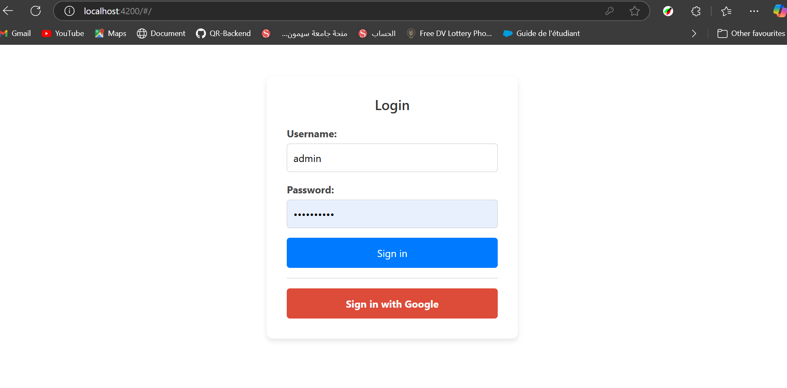

Ce projet a été généré avec Angular CLI version 16.0.4.

Frontend Angular connecté à un backend Spring Boot.

L’interface frontend est aussi simple que possible pour illustrer la logique d’authentification via un JWT.

Exécution en local
bash
Copier
Modifier
yarn start
L’application s’exécutera sur http://localhost:4200

Composants
Composant principal (App Component)
Composant principal servant de conteneur. Il gère l’affichage du formulaire de connexion (si l’utilisateur doit s’authentifier), du contenu protégé (si l’utilisateur est authentifié) ou de la page d’accueil (par défaut au chargement du frontend).

Composant du formulaire de connexion (Login Form Component)
Le formulaire de connexion affiche uniquement un lien vers l’URL d’authentification Google, fournie par le backend.

Se connecter en tant qu’administrateur

Gestion des utilisateurs

Gestion des fonctionnalités par rôle

Authentification avec OAuth2
L’authentification utilise le workflow OAuth2 pour sécuriser l’accès aux ressources protégées.

Étapes du processus :
1️⃣ Obtenir l’URL Google

Une requête est envoyée au backend pour récupérer l’URL de connexion Google.
2️⃣ Connexion de l’utilisateur

L’utilisateur est redirigé vers cette URL et se connecte à son compte Google.
3️⃣ Récupération du code d’authentification

Une fois connecté, Google renvoie un code d’authentification au frontend.
4️⃣ Échange du code contre un token d’accès

Le frontend envoie ce code au backend pour obtenir un access_token.
5️⃣ Utilisation du token pour les requêtes sécurisées

Le token d’accès est ensuite utilisé pour effectuer des requêtes aux endpoints protégés du backend.
Il est inclus dans l’en-tête HTTP sous la forme d’un Bearer token.
Configuration de Google Console pour obtenir le Client ID et Secret
Pour activer l’authentification OAuth2 avec Google, il est nécessaire de créer des identifiants dans la Google Cloud Console.

1️⃣ Activer l’API Google OAuth 2.0
Rendez-vous sur la Google Cloud Console.
Créez un projet ou sélectionnez un projet existant.
Allez dans API & Services > Bibliothèque.
Recherchez et activez l’API Google Identity Platform.
2️⃣ Créer des identifiants OAuth2
Dans API & Services, allez dans Identifiants.
Cliquez sur Créer des identifiants > ID client OAuth.
Choisissez "Application Web" comme type d’application.
Remplissez les informations :
Nom : (exemple) Authentification OAuth2
Origines JavaScript autorisées : http://localhost:4200
URIs de redirection :
http://localhost:4200
http://localhost:8080/api/auth/callback
Validez et obtenez votre Client ID et Client Secret.
